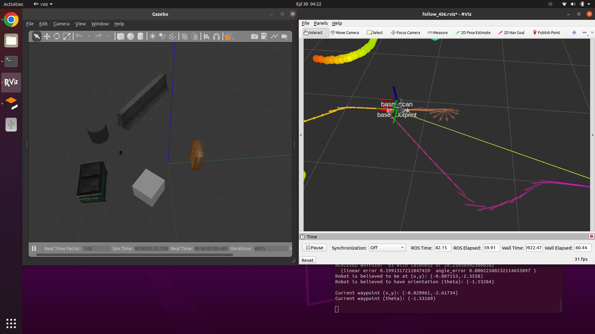

To start the simulation and 
1. Follow the steps on https://automaticaddison.com/how-to-launch-the-turtlebot3-simulation-with-ros/
2. Run the following: `roslaunch turtlebot_controller control.launch`

